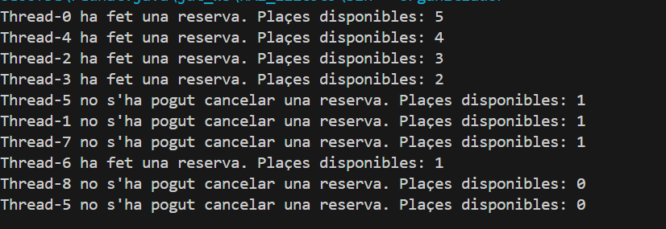

## 1. Per què s’atura l’execució al cap d’un temps?

Quan totes les places estan plenes, els fils que volen reservar entren en `wait()` dins `ferReserva()`. Si en aquell moment no queda cap fil actiu que pugui fer una cancel·lació, ningú farà `notifyAll()` i tots es queden esperant. Això fa que el programa sembli “aturat” (tots els fils bloquejats esperant).

## 2. Què passaria si en lloc d’una probabilitat 50%-50% fora 70% (ferReserva) - 30% (cancel·lar)? I si foren al revés?

### Cas A: 70% reservar / 30% cancel·lar

**Porció de codi modificada (Assistent.java):**

```java
if (rnd.nextInt(100) <= 70) {
	esdeveniment.ferReserva(this);
} else {
	esdeveniment.cancelaReserva(this);
}
```


## 3. Per què creus que fa falta la llista i no valdria només amb una variable sencera de reserves?

La llista permet saber **qui** ha reservat. Sense la llista només sabríem quantes places hi ha, però no podríem:

- Evitar reserves duplicades del mateix assistent.
- Verificar si un assistent pot cancel·lar (si realment havia reservat).
- Gestionar accions per persona (buscar, eliminar, etc.).